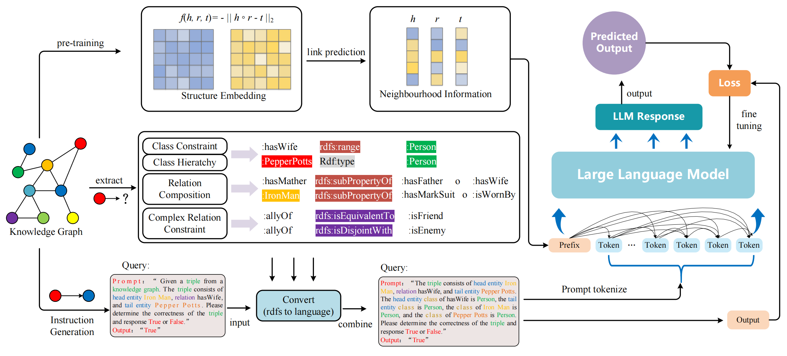

# Ontology-enhanced Knowledge Graph Completion using Large Language Models

> Large Language Models (LLMs) have been extensively adopted in Knowledge Graph Completion (KGC), showcasing significant research advancements. However, as black-box models driven by deep neural architectures, current LLM-based KGC methods rely on implicit knowledge representation with parallel propagation of erroneous knowledge, thereby hindering their ability to produce conclusive and decisive reasoning outcomes. We aim to integrate neural-perceptual structural information with ontological knowledge, leveraging the powerful capabilities of LLMs to achieve a deeper understanding of the intrinsic logic of the knowledge. We propose an ontology \textbf{kno}wledge-\textbf{en}hanced \textbf{KGC} method using LLMs --- \textbf{KnoenKGC}. It first leverages neural perceptual mechanisms to effectively embed structural information into the textual space, and then uses an automated extraction algorithm to retrieve ontological knowledge from the knowledge graphs (KGs) that needs to be completed, which is further transformed into a textual format comprehensible to LLMs for providing logic guidance. Finally, KnoenKGC integrates the structural information of the KG with ontological knowledge using LLMs for triple classification. We conducted extensive experiments on three widely-used benchmarks --- FB15K-237, UMLS and WN18RR. The experimental results demonstrate that KnoenKGC significantly outperforms existing mainstream KGC methods across multiple evaluation metrics, achieving state-of-the-art performance. The implementation of the algorithm and related data have been open-sourced.

## 🌈 Model Architecture


## 🔬 Dependencies
Our code is developed based on [GLM-4](https://github.com/THUDM/GLM-4).


You may need to fill the LLM path and save path before running. The hyper-parameters can be tuned by yourself.

- run inference
```shell
python main.py
```


